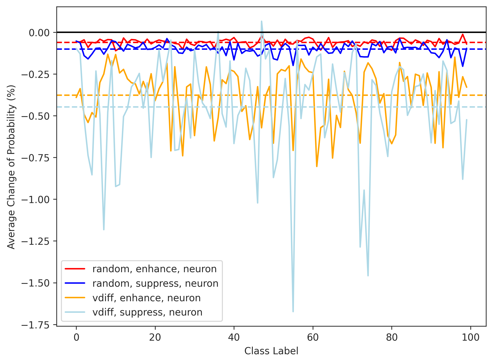
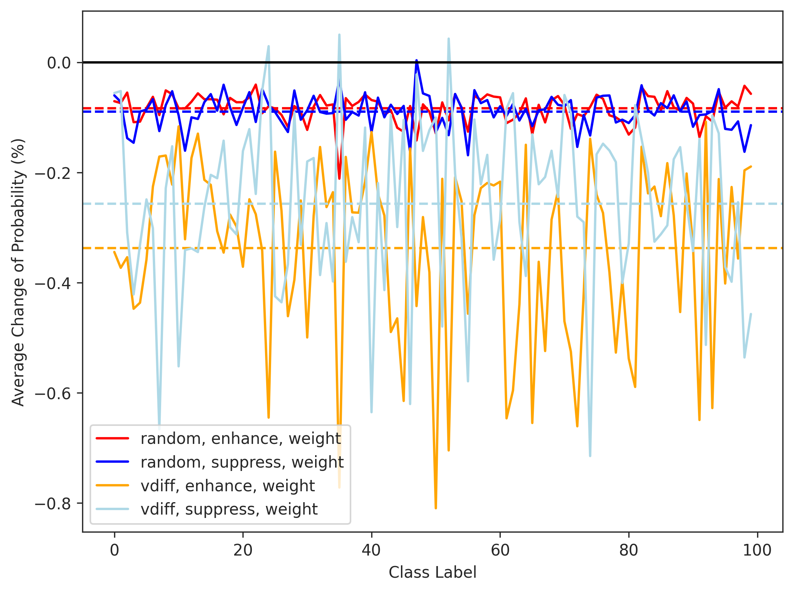

# exp-fl-1: 修正対象の重みの特定範囲の比較

FFNは3つの層からなる．
1. 768次元の層 (アテンションの出力を受け取る)
2. 4*768次元の層
3. 768次元の層

# 比較する方法

## A. (ニューロンレベル，粗い粒度) 知識ニューロン同様に，2.のみのV-scoreを使う
2.のV-scoreの値の高い順からx個特定する．
知識ニューロンの論文では2.のニューロン値をn倍していた．
2.のニューロンそれぞれから3.のすべてのニューロンにつながる重みを一律でn倍するのと同じ．

## B. (重みレベル，細かい粒度) 1., 3.のV-scoreも使う
1., 2., 3. すべてのV-scoreを計算して，1.-2., 2.-3.それぞれに対して，V-scoreの高いニューロン同士をつなぐ重みを特定する．
Aのやり方だと重み単位での特定ができないので，より細粒度にFLするための方法．
1., 3.からはy個ずつ，2．からは4y個ずつ特定する．
1.-2.の間の重みを4y^2, 2.-3.の間の重みも4y^2だけ特定する重みの数は合計8y^2個

## C. (ベースライン) ランダムな特定方法
重みをランダムに特定する．

## 必要なスクリプト
- 上の3つの方法をやってlocationのnpyを保存するスクリプト (`exp-fl-1-1.py`)
- 上のスクリプトで特定したlocationに介入を加え，その時の予測結果のnpyを保存するスクリプト (`exp-fl-1-2.py`)
- 上のスクリプトで得られた介入後のモデルの予測結果と，オリジナルモデルの予測結果とのdiffに関するdataframeを作るスクリプト (`exp-fl-1-3.py`)
- それを可視化するためのスクリプト (`exp-fl-1-4.ipynb`)
    - `exp-fl-1-4.py`: コマンドラインからグラフの保存まで実行可能にするためのスクリプト
- 検定のためのスクリプト（`exp-fl-1-5.py`）

# 評価方法

RQ1で想定しているFLの評価方法を使う．
つまり，特定したニューロンへの介入（ENH: 2倍，SUP: 0倍）を行い，特定方法（A，B，C），介入方法（ENH, SUP）ごとに，正解ラベルごとに正解ラベルへの予測確率の変化をプロットする．
横軸がクラスラベル (1から100) で，縦軸が確率の変化の値．線の本数は6本 (介入方法の数x特定方法の数)．

フェアな比較のために，変数の数を揃えたい．実際に介入される重みの数を合わせる．
- Aの1つのパラメータは，768のパラメータに対応する（Aの場合，1つのニューロンをn倍することはそれにつながる768の重みをすべてn倍することと同じなので）．
- つまり，768x = 8y^2となるようにしたい．これの整数解は(x,y)=(6,24),(24,48),(54,72),(96,96),(150,120),(216,144),(294,168),(384,192),(486,216),(600,240),(726,264),(864,288),(1014,312)...
- x=92で2.のレイヤのニューロン数3072の3%になる．一番近い `(x,y) = (96,96)` を使う．
- 実際の重み数は 768x96 = 8x96^2 = 73,728

# 期待する結果

この比較実験で修正対象の重み数を合わせるという目的ではフェアだが，実際にrepairを適用する際の変数の数の違いは大きい（96 vs. 73,728）．
粒度とfl/repair性能のトレードオフがあればおもしろい．
例えば，FLはBの方が効果的だとしても，その情報をつかってrepairをするにはとても時間がかかる（最適化の変数が多すぎる）．よって，時間をいくらでもかけていいならBでいいけど，現実的にはAでもいい（BとのFLの性能差にもより許容できるかのバランスは決まるが）．

# 実際の結果
ニューロン単位の結果

重み単位の結果

統計的検定の結果は `exp-fl-1_c100_wilcoxon_single_rank_test_results.csv` にある．
グラフからもなんとなくわかるけど，効果量は大きい．