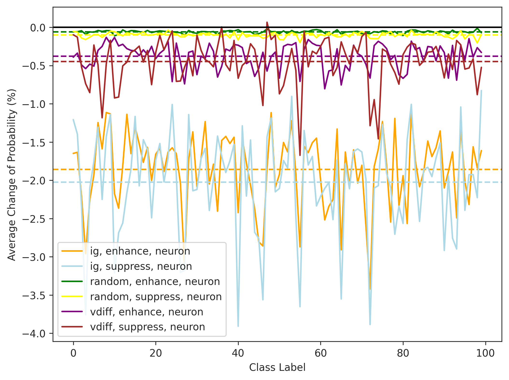
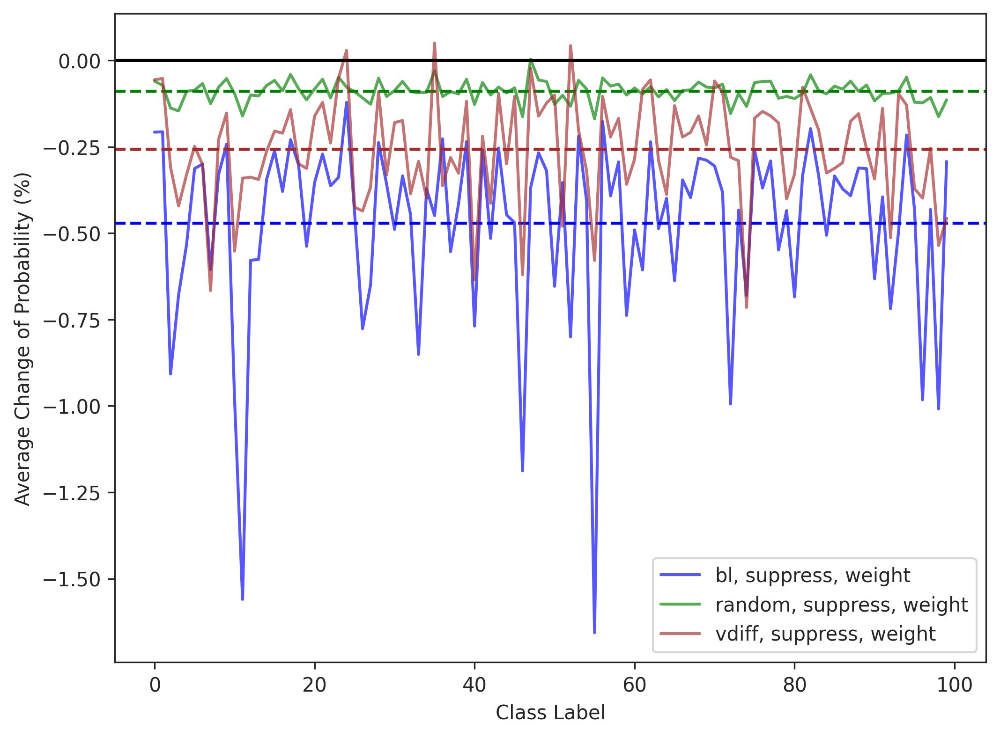

# exp-fl-2: 既存研究との比較

ベースラインとして，
1. ArachneのBL (Bidirectional Fault Localization)
2. 知識ニューロンのIG (Integrated Gradient)

と我々の手法を効果と効率の点で比較する．
ここまでやったらRQ1が終了．FLの結果で論文書けるくらいにはしておく．

# 必要なスクリプト
- 最終層のニューロンごとに integrated_gradient を計算して保存するためのスクリプト（`exp-fl-2-1.py`）
    - 知識ニューロンの論文の方法だと特定するニューロン数を指定できない．
    - そこで，ニューロンごとに，全サンプルにわたったスコアの平均を取り，その上位X件を特定する，という方法にする．Arachneも同様な方法にしたい．
    - 時間も測ってテキストファイルに出しておく．我々の手法との比較は 004a, 005bをするとできる？

- 最終層に ArachneのBL を実行して保存するためのスクリプト（`exp-fl-2-2.py`）
    - ArachneのBLの実装の練習用に，gradient周りについて確認したい（`playground/exp-fl-2-2-1.ipynb`）. autogradなどについて大体わかった．
    - Arachneのメモリ使用量が多すぎて全然実行できない．これは結構なデメリットではないか．一度ちゃんと考察したい．
        - [解決理由] torchのtensorのデバイスをgpu-cpu間で移動するタイミングを見極める．上から1行ずつコメントアウト外してgpu/cpuのメモリ消費を確認しつつ見極める．また，計算グラフを保持しないdetachをうまく使う．その結果めっちゃ早くなった．
    - 我々の手法の時間計測してないのでもう一回する（訓練済みモデルはある状態で，repair setをfeedしてv-scoreを各誤分類タイプで計算するスクリプト）
    - 現在のコードはpareto frontを取るので重みの数を制御できない．制御可能にするため，pareto frontによる多目的最適化を重みつき平均（grad_lossとfwd_impをそれぞれ正規化してから等しく重み付）による単目的最適化にする．
- IGとBLそれぞれで特定したlocationに介入を加え，その時の予測結果のnpyを保存するスクリプト (`exp-fl-2-3.py`)
- 上のスクリプトで得られた介入後のモデルの予測結果と，オリジナルモデルの予測結果とのdiffに関するdataframeを作るスクリプト (`exp-fl-2-4.py`)
- それを可視化するためのスクリプト (`exp-fl-2-5.ipynb`)
    - `exp-fl-2-5.py`: コマンドラインからグラフの保存まで実行可能にするためのスクリプト
- 検定のためのスクリプト（`exp-fl-2-6.py`）

# 評価方法
比較手法が増えただけなので基本的には exp-1 と同じ．
integrated gradientはニューロン単位，BLは重み単位の方法になるのでそこは違う．
ただし変更する数は合わせたい．

## FLに使うデータ
- IG: 提案論文ではラベルごとにアルゴリズムを実行しているが荒い粒度にもできる．今回は，全データを使ってKNを特定する（V-score/allと同じ）．間違っている，あっているで2つに分けるような手法ではないので全設定での比較ができない．
- BL: 不正解サンプルと正解サンプルはご分類の種類ごとに定義できるので，それぞれの設定でできる．V-scoreの全ての結果と対応するBLの結果を作れる．

# 期待する結果
予備実験のようにigで特定したニューロンがenhanceして正解確率を増やせたらおもしろい．
randomよりは変化があってくれ．

# 実際の結果
ニューロン単位

重み単位

- exp-fl-1でもそうだが，基本的に正解確率が下がるという結果になっている．
- 修正の成功は「変更する場所」と「変更する内容」の2つのファクターからなる．
    - 「変更する場所」：結果が大きく変化するような場所を変更した方が修正がうまくいくと仮定する．いじっても出力に影響しない重みは変えたくない．このRQ1ではそれをチェックしたい．つまり，変化の絶対値が重要なのであって，符号は重要ではない．
    - 「変更する内容」：そのような結果が変わるポテンシャルのある場所に限って，適切なパッチを適用することで，修正を成功させるのがRQ2．
- enhanceで二倍するのがやっぱりよくわからないので，0にすることでそれらの重みを無効化するとどうなるか，という観点で行きたい．

## 時間の比較
[exp-fl-1の結果にigとblをそれぞれ追加したのを載せる]

## 時間の比較
- ランダム: 当然0
- vdiff: 
- integrated_gradient: 