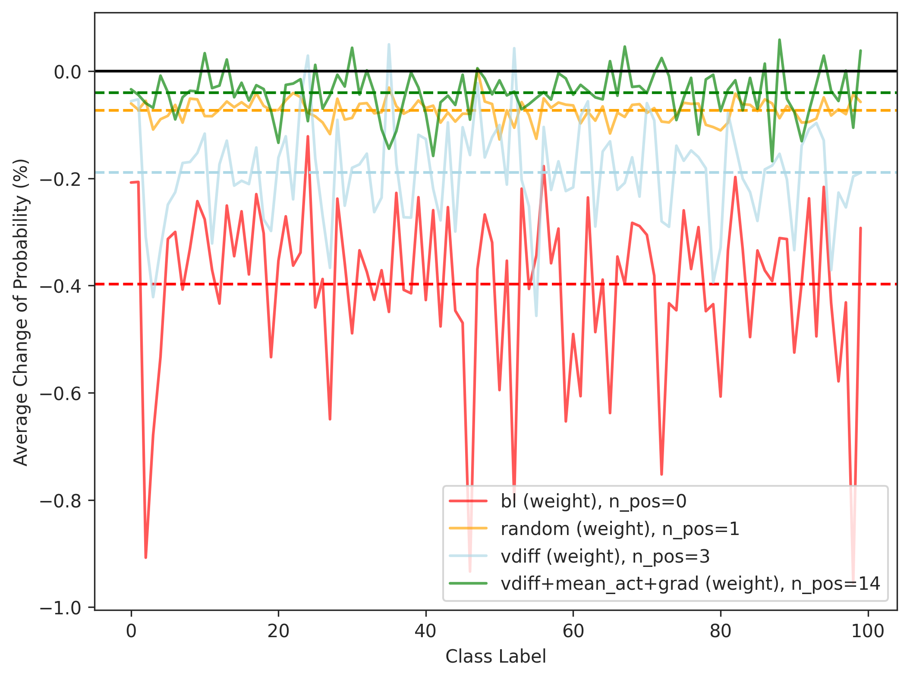
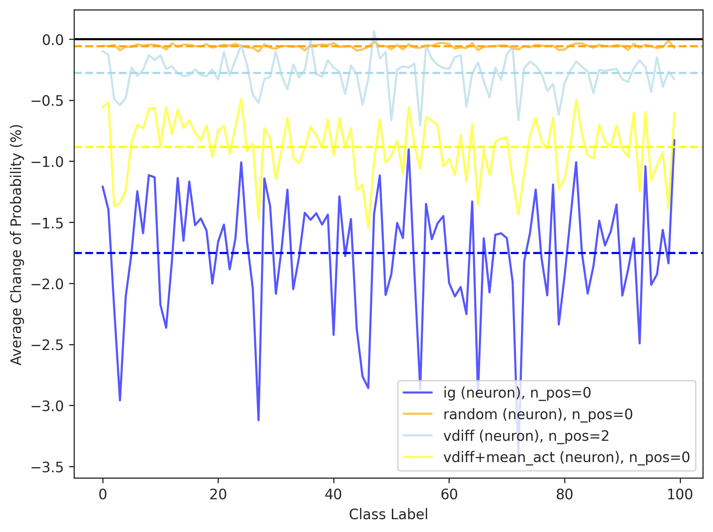

# exp-fl-4: 知識ニューロンと似た方法によるFLの評価方法の改善

Paoloとの打ち合わせを受けて発生．
今は特定した重みorニューロンを0にした時の予測確率の変化を確認して，0にして予測精度が上がる -> faultsだった，としている．
ただ，repairの観点では0はある一つの値でしかない．
0にするだけでは，そのrepaired valueが0であるような欠陥重み/ニューロンしか見つけられない．
ある重みが欠陥であるとして，それを0にすることが悪影響を及ぼす可能性がある．逆に，増幅させることがプラスの影響（正しいrepair方向）の可能性もある．

これを考慮するために，プロットする値を max((2倍した時のdiff), (0倍した時のdiff)) とする．
これで増幅と抑制の2つのrepair方向を考慮できる．これはrepairの伸び代がどれくらいありそうかを表しており，これが高いほどそれは治すべき重み = faultyである．とする．

## 実験方法
これまで0倍した時のdiff, 2倍した時のdiffはそれぞれとれているので，maxを取ってプロットし直す，ということをすれば良い．

## スクリプト
- `exp-fl-4-1.py` : 各手法のdfを結合してenh/sup良い方との予測確率の差の折れ線グラフをクラスごとに表示
- `exp-fl-4-2.py` : 上の操作でよくなったクラス数を誤分類タイプごとに，csvでまとめる
- `exp-fl-4-3.py` : ?
- `exp-fl-4-3.py` : あとから追加したやつ．データサンプル全部の結果をまとめるのではなく，正解時と不正解時のサンプルそれぞれに対する影響を別々に調査する評価方法．

## 実験結果

